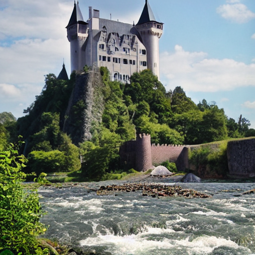
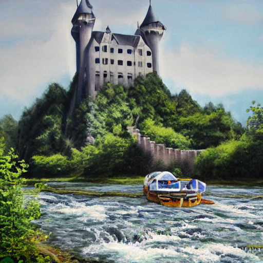

# Stable Artist

## Overview
The **Stable Artist** project uses text prompts to guide the **latent diffusion model space**. It does not involve any training, but utilizes **Stable Diffusion** and other libraries for generating and editing images based on input text prompts. The goal is to provide a framework for **semantic image editing** using latent space manipulation.

## Links

* [Semantic Image Editing GitHub Repository](https://github.com/ml-research/semantic-image-editing/tree/StableArtist)
* [Diffusers GitHub Repository](https://github.com/huggingface/diffusers)
* [Stable Diffusion Model - Hugging Face](https://huggingface.co/stable-diffusion-v1-5/stable-diffusion-v1-5)

## For running inference 

### Step 1: Upgrade Pillow
```bash
pip install --upgrade pillow
````

### Step 2: Install Diffusers

```bash
pip install --upgrade diffusers[torch]
```

### Step 3: Fix for Stable Diffusers

Modify `sem_diffusers\pipeline_latent_edit_diffusion.py` to include:

```python
import diffusers.pipelines.pipeline_utils
```

### Result

* **Base Image Generation**: 13 minutes runtime on a **4GB RTX 3050** for generating the base image.


* **Editing with Prompt**: 30 minutes runtime for image editing with the following prompt:

  ```python
  editing_prompt = [
    'oil painting, drawing',
    'modern bridge',
    'ship on a river, ship'
  ]
  ```


## Future Work

1. Train audio encoder and text encoder to get the editing prompts from audio
2. Use audio and text data for training
3. This basically means we are converging towards TPOS but for single frame

## Potential Enhancements

* We could also change the way the text encoding moves the stable diffusion process in latent space


